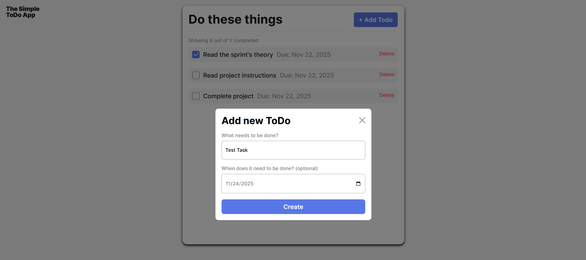
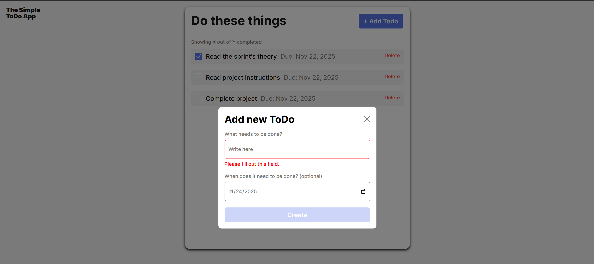
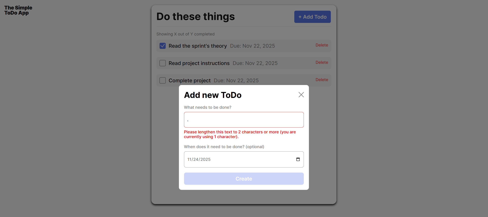

# Simple Todo App

This is simple To Do app. User is able to add a Task to a list, check it off, and/or delete that task.

## Functionality

The project functionality was to create a ToDO and FormValidator class to make it more effecient code.

## Technology

Here you can see the screenshots of the FormValidator class in work. It will validate this task form and display errors depending on the inputs.

## Deployment

This project is deployed on GitHub Pages: [Link Here](https://mestabarbara.github.io/se_project_todo-app/)
